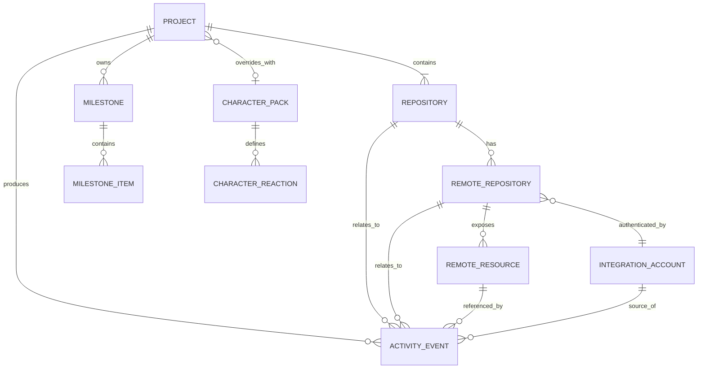
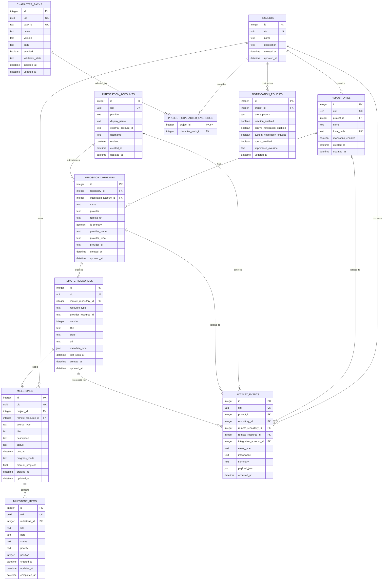

# 9. Data Model

# Conceptual ERD



## Conceptual Decisions

- Project and Repository are different concepts.
- One repository belongs to one Xenrya project at a time.
- Projects currently require at least one repository.
- Repositories may have multiple remotes.
- One remote may be primary.
- Milestones belong to Projects.
- Imported milestones remain source-aware.
- Activity events have a primary Project and optional related entities.
- PRs/MRs/issues/reviews/pipelines use a normalized `Remote Resource`.
- Character selection is global-default + optional project override.

---

# Actual ERD



## Database Rules

- Major user-owned entities use integer PK + stable UUID.
- Normal deletions use hard delete with confirmation where appropriate.
- Git remains source of truth for current branch/dirty/ahead/behind state.
- Credentials never live directly in SQLite.
- Character assets stay on disk.
- Character-pack DB records store metadata only.
- Activity retention permanently purges expired events.
- Remote resources are retained while active/relevant or referenced.
- Foreign keys are enabled.
- Project deletion removes only Xenrya-owned metadata, never local repos or remote provider data.
- Indexes are added based on actual query patterns.

## Likely Initial Indexes

```text
repositories(project_id)
repository_remotes(repository_id)
milestones(project_id, status)
milestone_items(milestone_id, position)
activity_events(project_id, occurred_at)
activity_events(event_type, occurred_at)
remote_resources(remote_repository_id, resource_type)
```
